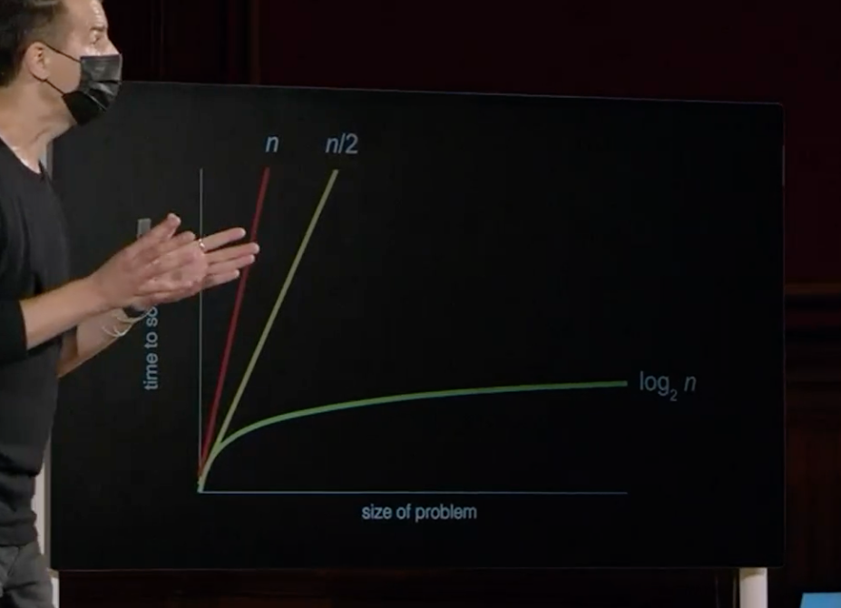
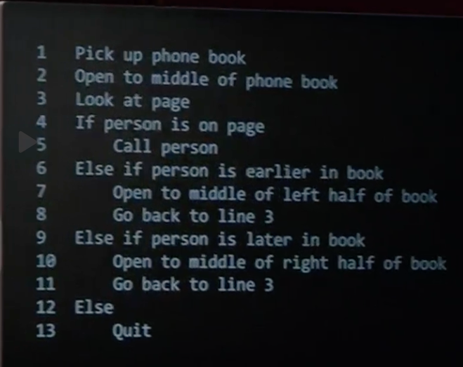

# Week 0

## Lecture Notes

- At the core of it, computers use binary (only 0s and 1s)
- Binary representations:
    - 000 = 0
    - 001 = 1
    - 010 = 2
    - 011 = 3
    - 100 = 4
    - 101 = 5
    - 110 = 6
    - 111 = 7
- Decimal Representation: 102 101 100 -> # # #
- Binary Representation: 22 21 20 -> # # #
- Letters: A = 65 (decimal) = 01000001 (binary)
    - ASCII (American Standard Code for _ _)
    - `rawToChar(as.raw(c(72, 73, 33)))` = "HI!"
    - ASCII is 8 bits and has 256 possible characters
- Unicode is a superset of ASCII
    - Can use 16 or 32 bits, which allows for many more characters
    - Each company can interpret the bits differently, which can lead to 
    miscommunication 
- Colors are represented with RGB (0-255, 0-255, 0-255)
- Sounds are represented with MIDI
- **Algorithm**: step by step instructions to solve a problem
- 
- 

~~~ PAUSED AT 50:39 ~~~

From the stage (binary lights): 
    